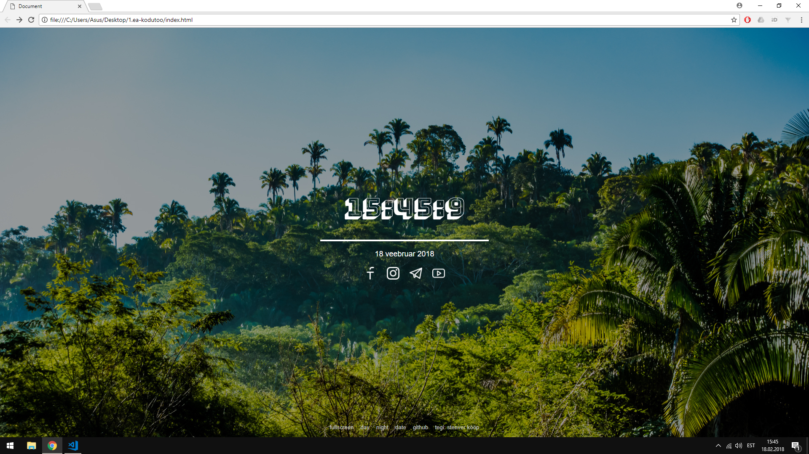
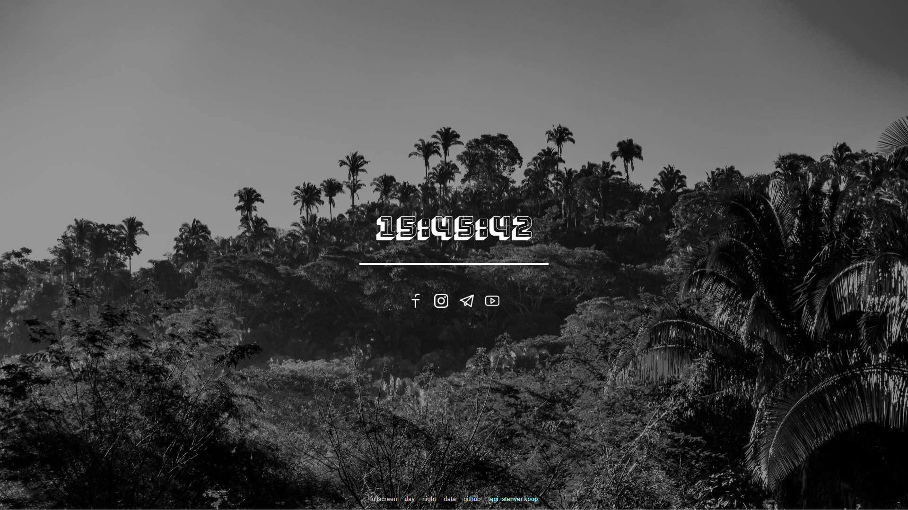

#### Stenver, 2018 ####  
- - - -

## FEATURES: ##  
* Clock with Day, Month, and Year
* Day / night mode  
* Go fullscreen  
* Change text color  
* Hide date 
* Shortcuts to Gmail, Facebook, Twitter, YouTube 
* Relaxing background photo
* Awesome googleFont

## SCREENSHOTS: ##   
  
  

# 1. kodutöö – Lauakell

## Tähtpäev 18.02.2018 23:59

Kujunda kellanäide vastavalt maitsele või kindlale teemale, mahutades kella täisekraanile, et saaks kasutada lauakella või ekraanisäästja asemel. Selleks, et see sobiks paljudele ekraanidele, kasuta kujunduse loomisel protsendilisi väärtusi (nt width: 100%; ) või nt võimalda kella suurust kasutajal muuta.

## Nõuded

1. Veebirakendus töötab. Näitab kella, kuupäeva ja nädalapäeva.
1. Vastavalt kasutaja tegevusele on võimalik muuta **kolme** lauakella atribuuti muuta (nt suurus, värv, asukoht vms)
1. Kell on originaalne ning kasutajaliides on maitsekalt kujundatud
1. Autori ees- ja perenimi on lehel välja toodud
1. Lehel on viide rakenduse repositooriumile
1. Kood on vormistatud vastavalt stiilijuhendile
1. `README.md` failis on välja toodud autori nimi, ekraanipilt rakendusest ja kirjeldatud funktsionaalsus
