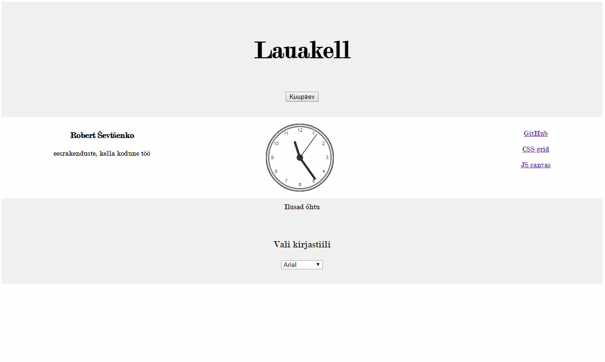

# 1. kodutöö – Lauakell
Autor : Robert Ševtšenko

# Funktionaalsus

1.Veebileht võimaldab muuta tesktide kirjastiile.
2.Muutes veebilehe suurus muutb automaatselt taustavärv.
3.Muutes veebilehe suurust kitsamaks ülesehitavad elemendid end horisontaalselt.
4.Vajutades nuppule "Kuupäev", kerkib ette teate tänase kuupäeva kohta
5.Kella all sõltuvalt ajavahemikust muutub tervitus.
6.Kellaaega esitatakse analoogse kella kaudu.

# pildid

