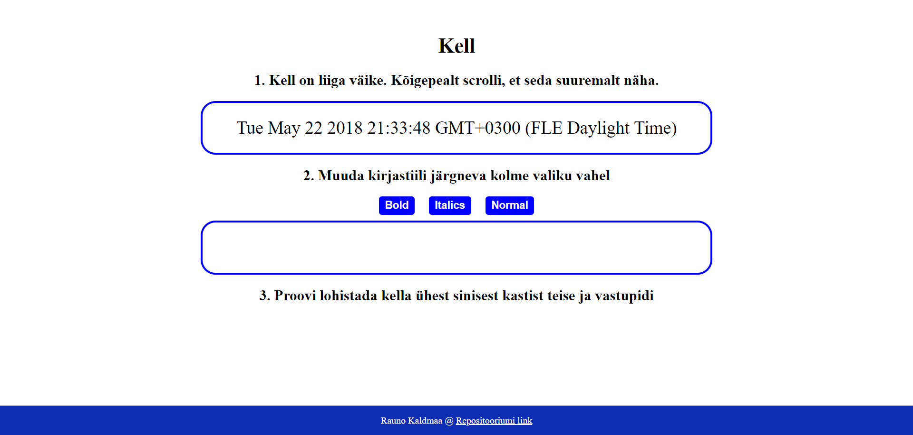

# 1. kodutöö – Lauakell

Autor: Rauno Kaldmaa

Funktsionaalsused:

1. Kella suurus on vaikimisi väike. Hiire scrollimiseks muutub suurus loetavaks.
2. Kella fonti saab muuta kolme valiku vahel - bold, italic ja tavaline.
3. Lehel on kaks sinist kasti, millest üks asub üleval ja teine all. Kella saab lohistada ühest kastist teise ja vastupidi.

Ekraanipilt

